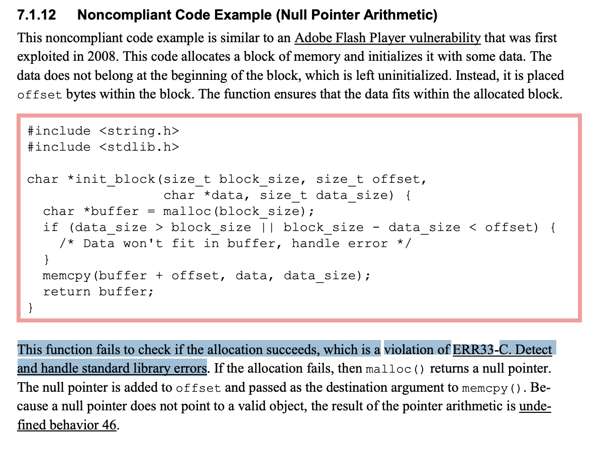

# Should you check what malloc() returns?

Shortly: "Yes".

## Arguments and links

The Standard. Annex j part (starts on page 406). More precisely "J.3.12 Library functions" (page 422)
[Standard ISO/IEC 9899:yyyy](http://www.open-std.org/jtc1/sc22/wg14/www/docs/n2310.pdf)

Article [Why it is important to check what the malloc function returned](https://medium.com/pvs-studio/why-it-is-important-to-check-what-the-malloc-function-returned-ba39f3d13a83)

Статья на русском [Почему важно проверять, что вернула функция malloc](https://habr.com/ru/company/pvs-studio/blog/348098/)

Example from [SEI CERT C Coding Standard: Rules for Developing Safe, Reliable, and Secure Systems (2016 Edition)](https://resources.sei.cmu.edu/downloads/secure-coding/assets/sei-cert-c-coding-standard-2016-v01.pdf):


And table [13.3 ERR33-C. Detect and handle standard library errors](https://resources.sei.cmu.edu/downloads/secure-coding/assets/sei-cert-c-coding-standard-2016-v01.pdf#page=392&zoom=100,141,121)

## Show me what would happen if malloc() returns NULL?

from [@oadhesiv](https://github.com/secondfry):
```c
#define BUFFER_SIZE 1000000
int main() {
  int *data = 0; // имитируем сфейлившийся маллок
  data[BUFFER_SIZE - 1] = 0;
}
```

from [@mtrisha](https://github.com/elijahkash)
```cpp
#include <iostream>
#include <stdlib.h>
int main() {
  int *some_data = (int*)malloc(4);
  *some_data = 0;
  unsigned long long x = (unsigned long long)some_data / 4; // какое-то большое значение получившиеся в результате каких-либо вычислений
  int *another_data = NULL; // имитируем сфейлившийся маллок
  another_data[x] = 100;
  std::cout << *some_data << std::endl;
  //вот это не сегается. хотя разименовываем нулевой указатель
}
```