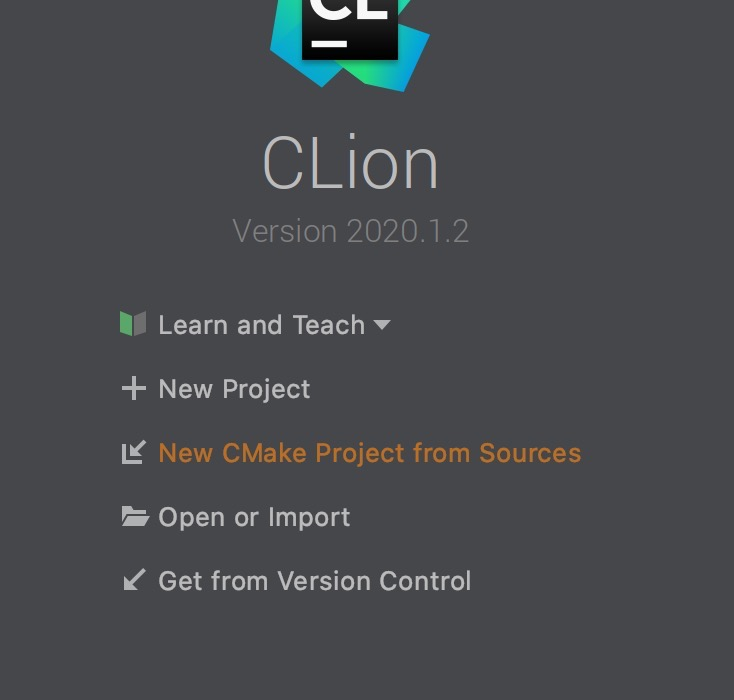
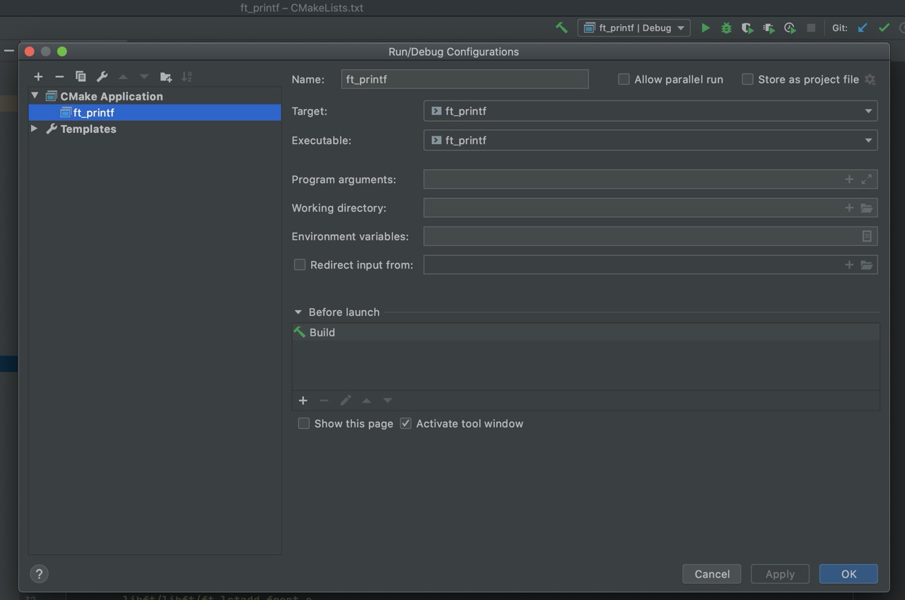
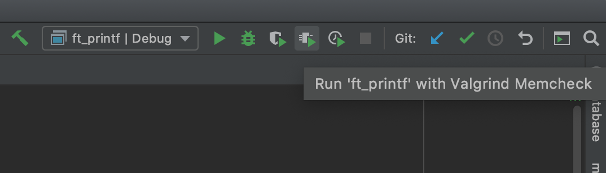
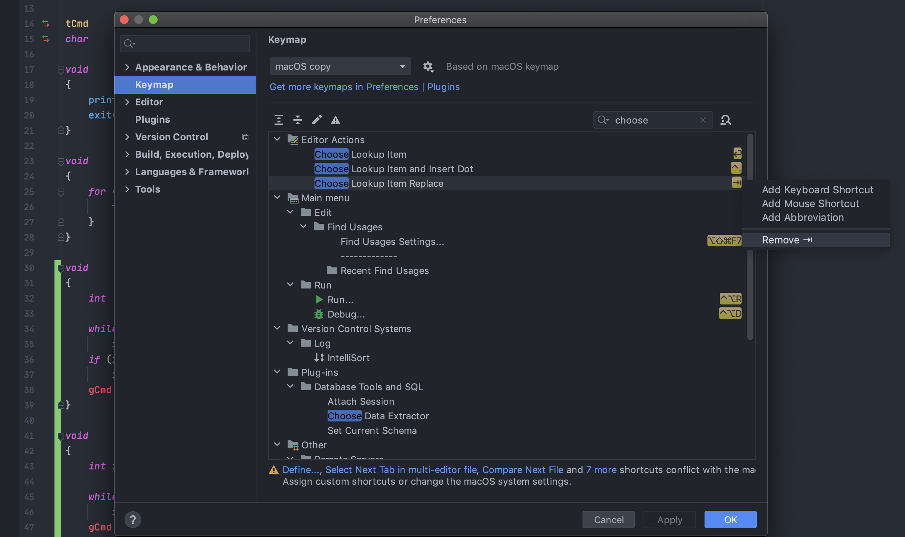

# Инструкция для Clion

Если у меня уже есть хоть сколько-то файлов моего проекта, захожу в Clion и выбираю `New CMake Project from sources`

</img>

Дальше ставлю галочки на файлы, которые хочу добавить в проект.

Ок.

И Clion прописывает все названия (вместе с путями) в файл `CMakeLists.txt`.

Всё, можно нажать на play в правом верхнем углу и пользоваться дебагером.

Если не завелось, проверьте `CMakeLists.txt` и настройки `Run/Debug configurations`

</img>

Чтобы добавить новый сорс, просто прописываем его название в `CMakeLists.txt` как на картинке.

</img>

Когда проект создан, файлы можно добавить только вручную. Автоматически, к сожалению, пока нельзя - https://youtrack.jetbrains.com/issue/CPP-1749. Вы можете прокомментировать задачу или проголосовать за нее.

Если Вы не знакомы с YouTrack: https://intellij-support.jetbrains.com/hc/en-us/articles/207241135-How-to-follow-YouTrack-issues-and-receive-notifications

## Чтобы компилировать с флагами

В `CMakeLists.txt` пропишите:

`set(CMAKE_C_FLAGS "${CMAKE_C_FLAGS} -Wall -Wextra -Werror")`

Для проекта `get_next_line` прописываем это:

`set(CMAKE_C_FLAGS "${CMAKE_C_FLAGS} -Wall -Wextra -Werror -D BUFFER_SIZE=32")`

## Valgrind

Если `valgrind` установлен, то больше ничего настраивать не надо. Просто нажмите эту кнопку.

</img>

Если есть что добавить — [пишите](https://t.me/kukinpower/)

# Turn off annoying autocompletion by tab

</img>
