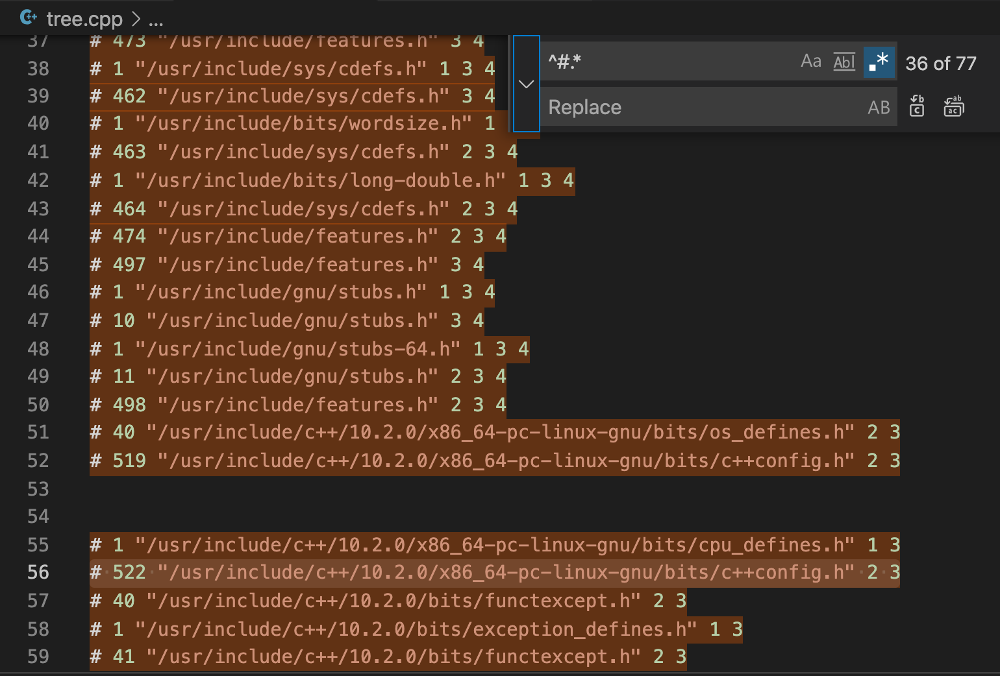

# I wanted to read source code of exactly c++98 std STL GNU STL implementation

## tl;dr
On linux machine create `main.cpp`  
```
#include <map>

int main() {}
```

And get the preprocessor work result  
```
g++ main.cpp -std=c++98 -pedantic -E > somefile.cpp
```

enjoy reading `somefile.cpp`

## Why
I had a study project: Implement several c++98 STL containers.
I code on mac. And macos header files contain code which is pretty difficult to read. Also you can't actually compile c++ code with c++98 std on mac. I guess you can, but it's not trivial.

I did not find the source code of any STL 98 standard implementations on the internet.

## Solution
The idea is to read GNU implementation source code specifically with c++98 std.

GNU implementation is readable. And you can compile code on Linux using `-std=c++98 -pedantic` flags and it will actually do what you want.

If you are using Linux, you can just run this and get the result of preprocessor work
```
g++ main.cpp -std=c++98 -pedantic -E > somefile.cpp
```

If the system is pure, install `glibc` and `gcc` using system's package manager. Just google it.

## On mac
You can create virtual machine with Linux. I used `VirtualBox`. And `Manjaro` OS.

## Bonus tip one
You can connect via `ssh` to your `virtual machine`, using `Visual Studio Code`. And edit files remotely as if locally. It's pretty nice. I can advise this guide to do this: https://code.visualstudio.com/docs/remote/ssh.

## Bonus tip two
Use your editor to autoreplace all occurences of preprocessor code you don't need.

With this `regex`
```
^#.*
```



And this one to remove empty lines
```
\n\n
```

And also you can auto style the document with your editor to make it more familiar to you  

17 April 2021
Roman Kukin
