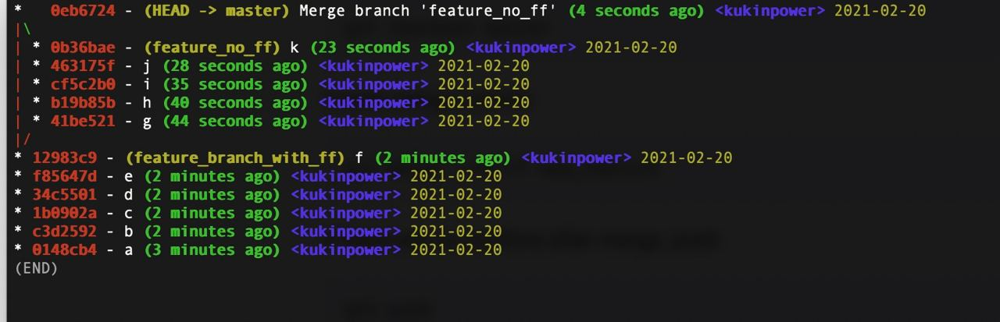

# Git cheatsheet

## Rename current commit before push
```
git commit --amend -m "your commit message"
```

## What --no-ff option does
`--no-ff` means "no fast-forwarding"  
Using this option makes git create merge commit  
By default, fast forwarding is enabled, and the `git merge branch` operation will simply move all commits from the branch to the master

Let's look at the image.
1. I create `a,b` commits on `master`.
2. Checkout to a new branch `feature_branch_with_ff`.
3. Create the commits `c,d,e,f`.
4. Checkout back to `master` and run `git merge feature_branch_with_ff` command.  
As you can see, all the commits from `feature_branch_with_ff` look as if they were always on the `master` branch.  
5. Checkout to a new branch `feature_no_ff`.
6. Create the commits `g,h,i,j,k`.
7. Checkout to `master` and run `git merge --no-ff feature_no_ff`  
Only merge commit was created on master. 

more on [stackoverflow](https://stackoverflow.com/questions/9069061/what-is-the-difference-between-git-merge-and-git-merge-no-ff)

## Remove previous commits
```
git rebase -i HEAD~4
```
then `pick` commits you want to stay, and `drop` commits you want to delete

## Create branch and checkout
```
git checkout -b <branch_name>
```

## Rename local branch when remote was renamed
```
git branch -m previous current
git fetch origin
git branch -u origin/current current
git remote set-head origin -a
```

## Stop tracking file
```bash
git update-index --assume-unchanged filename
```

## Undo and start tracking again
```
git update-index --no-assume-unchanged filename
```

## Download specific directory from github repo
pattern
```bash
curl https://codeload.github.com/[owner]/[repo]/tar.gz/master | \ tar -xz --strip=2 [repo]-master/[folder_path]
```

example
```bash
curl https://codeload.github.com/kukinpower/dev_cheatsheet/tar.gz/main | tar -xz --strip=2 dev_cheatsheet-main/img
```

## Show git branches graph in shell
```
git log --graph --oneline
```

## View git objects in shell
```
git cat-file -p <object hash>
```

## Commit with specific date
override the commit date
```
git commit -m "message" --date YYYY-MM-DD
```

## Set default branch name globally
```
git config --global init.defaultBranch main
```

# Git and Github
The difference between git and github is like porn and pornhub

# Windows
## Long paths
```
config --system core.longpaths true
```
or if not enough rights
```
config --global core.longpaths true
```
